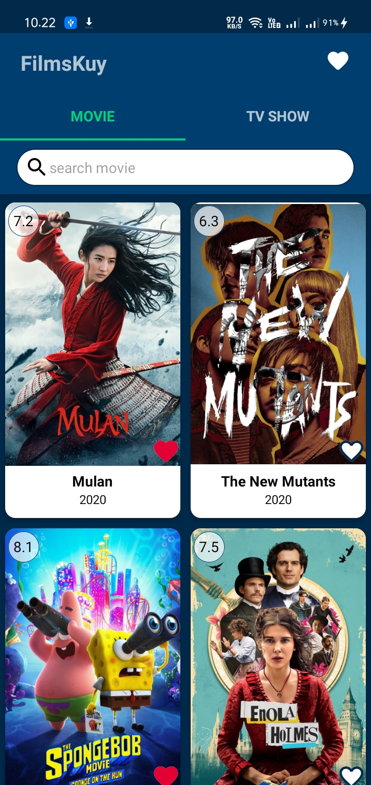
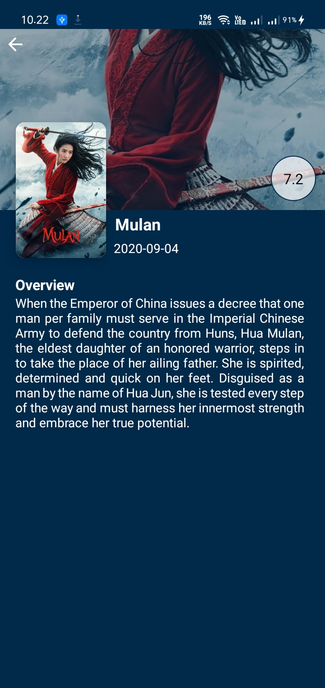
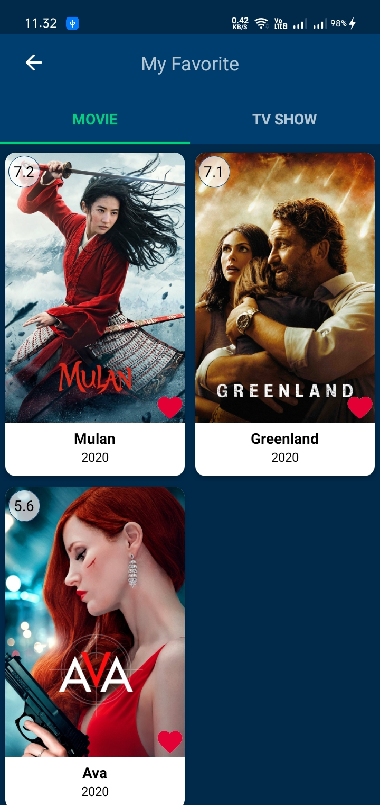
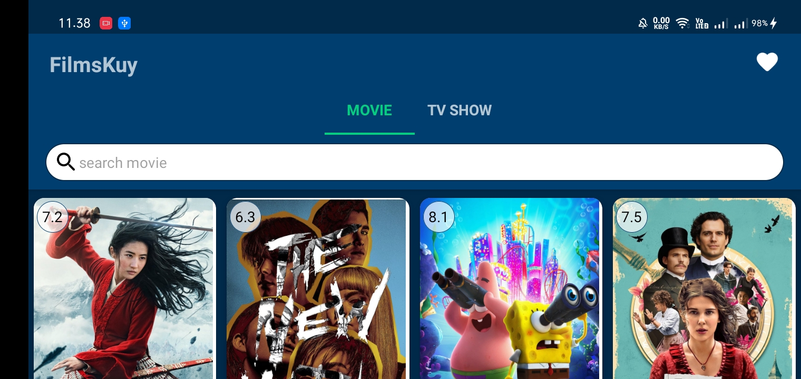
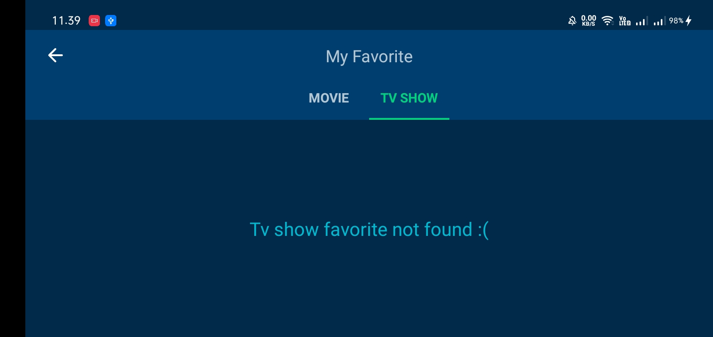

# Android Jetpack Pro
Please use as a reference guys :)  

## Submission
### Submission 1 (Achitecture Component): 
* Android Jetpack (Foundation, Architecture, Behavior, UI)
* Architecture Component (Architecture Pattern, ViewModel and Lifecycle)
* Unit testing (JUnit)
* Instrument testing (Espresso)

### Submission 2 (Repository and LiveData):
* Repository and LiveData
* <strike>Dependencies Injection (DI)</strike>
* Retrofit
* Idling Resources
* Unit testing (JUnit and Mockito)
* Instrument testing (Espresso)

### Submission 3 (Manage Data):
* Room
* Pagination
* <strike>RawQuery</strike>
* Unit testing (JUnit and Mockito)
* Instrument testing (Espresso)

## Screenshot Apps

  
  
  

  
  
  

